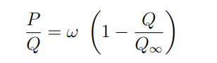

### Resource Model principle

This model takes in input the annual demand of resource from energy mix model (all resource demand dataframe).
It gives in output the resource mean price per year, the predictable production per resource subtype,
the quantity of resource used each year in order to answer the demand, the production in excess which is stocked for the future need.
To calculate all this dataframe the model takes in input the demand and the past production data of each resource subtypes.
With these data we can calculate the Hubbert curves used in prediction of production.
The prediction on resource production shows when the addition of production, stocks and potential recycled production will no longer be able to answer the annual demand.
Stocks are calculated with the production excess. Each year the model puts, in the stock, all the production not used in the year.
The model uses as a priority the resource subtypes which are the less expensive, then it stocks the more expensive one if there is production in excess.
The price is calculated as the mean value of all the extraction price. It takes each subtype price and calculate according to each subtype proportion the resulting price.

### Hubbert model for resource production prediction [^1]

This model can give different information:
* The approximate year of a given resource production peak
* The estimate maximum quantity of the stock
* The projection on production capacity for the future year

The computing of this information is based on the extrapolation of the past production. With this extrapolation we find some parameters useful in the predictable production equation:

In this equation we have:
- P: production per year
- Q: cumulative production per year from year start
- tau: is the year of uranium peak
- w: is the frequency
- Qinf: the maximum stock usable

We can find w and Qinf with the linear regression between production (P) and cumulative production (Q)

### References

[^1]: Jon Claerbout and Francis Muir - "Hubbert math" (2020) - Retrieved from: 'http://sepwww.stanford.edu/sep/jon/hubbert.pdf'
