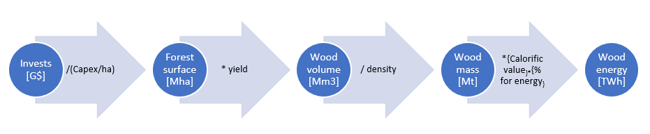

Forests are a natural consumer of CO2. As CO2 has a major impact on the temperature evolution, tracking the evolution of forests and their CO2 consumption is important in order to get accurate results.
Many factors can lead to a reduction of the global forests surfaces, such as consequences of temperature change and human activities. On the other side, environmental care and policies can lead to a rise of the global forest surface.

The global forest surface can evolve depending on the balance between planted vs removed trees at a given year (can be due to human activities or natural causes such as fires, deseases, natural seeding, etc.)
This introduces definitions that can be misleading:

- **Forest**: more than 200 definitions exist. According to the FAO: "land spanning more than 0.5 hectares with trees higher than 5 meters and a canopy cover of more than 10 percent, or trees able to reach these thresholds in situ. It does not include land that is predominantly under agricultural or urban land use" [^16]. This definition is however controversial since monocultures can become forest whereas they have negative impacts on the biodiversity [^14]
- **Other wooded land**: Land not classified as "Forest", spanning more than 0.5 hectares; with trees higher than 5 meters and a canopy cover of 5-10 percent, or trees able to reach these thresholds in situ; or with a combined cover of shrubs, bushes and trees above 10 percent. It does not include land that is predominantly under agricultural or urban land use [^16].
- **Afforestation**: replanting trees on non-treed land which historically has not contained forest [^12]. This introduces a time-scale (see deforestation)
- **Reforestation**: replanting trees on non-treed land but that was previously covered by trees before harvesting [^12].
- **Deforestation**: the conversion of natural forest to other land uses [^13] and more precisely, long-term or permanent removal of forest cover and conversion to a non-forested land use [^12]. It may be due to human activities (timber harvesting, deforestation), desease, fires.NB: Clear-cutting (even with stump removal), if shortly followed by reforestation, is not deforesting [^12]. If they do not meet the "direct human-induced LULUCF activities" requirement, they would not be included as deforestation under Article 3.3. [^12]. This introduces a time-scale between cutting and replanting the trees.
- **Managed forest**: according to the FAO, managed forests are areas where humans actively influence the composition and growth of trees. This intervention can take various forms, including planting specific species, thinning existing trees, controlled burns, and harvesting timber or other products. Management plans are typically created for these forests, outlining specific goals for the land. These goals can be diverse, ranging from timber production and pulpwood provision to wildlife habitat creation or recreational purposes. Therefore, managed forests are not exclusively for wood production. Primary forests can be managed forests [^16]
- **Unmanaged forest**: forests that are left to develop and grow naturally, with minimal human intervention
- **Plantation forest**: Plantation forests are a type of managed forest in which the trees are planted (as opposed to naturally regenerated), of the same age and generally of the same species, and are intended to maximize the production of wood fiber. Trees in a plantation forest are usually planted uniformly in rows to maximize the site's growing space and resources, to ensure uniform growth, and to facilitate the use of mechanized harvesting equipment. [^14]

NB: due to the absence of consensus in the above definitions, discrepencies can be found in the data from the literature.

To make things simpler, the current forest model in witness considers **that forest surface increases only through afforestation of managed or unmanaged forest**.
To do so, investments are respectively performed through the model inputs "managed wood investment" and "reforestation_investment". NB: the term reforestation is used here in a similar way as afforestation.
Conversely, the model considers that the forest surface can decrease only through deforestation.
To do so, investments are performed in the model input "deforestation_investment".

If no new investment in managed wood is performed, the model considers that the surface of managed forest remains constant, namely that
continuous wood harvesting is compensated by continuous tree plantings. This leads to a wood yield considered constant over the years.
In managed wood activity, it is assumed that the operational costs due to harvesting and planting trees are covered by the sale of the wood.

In this model, the harvested wood generates biomass products (wood and residues) that are used for industry or energy.

## Model data

The forest model takes the following data as inputs:

- **year_start**, the first year of the study. Default is 2020.
- **year_end**, the final year of the study. Default is 2100.
- **time_step**, the number of year between two data computation. Default is 1.
- **deforestation_investment**, the money invested in the deforestation. Unit is G$. Reference value is 38.6 G$ in 2021 [^4] modulo the uncertainties on the definition of deforestation (see above)
- **deforestation_cost_per_ha**, the average price to deforest 1ha of land. Unit is \$/ha. Default value is 12000 \$/ha [^1].
- **CO2_per_ha**, the quantity of CO2 captured by 1 hectare of forest during one year. Unit is kgCO2/ha/year. Default value is 4000kgC02/ha/year [^2].
  As forest captures 16 Gt of CO2 per year, reducing forest by 1% results in a deficit of CO2 captured of 160 Mt. The value of 4000kgCO2/year/ha is coherent with these data.
- **Initial CO2 emissions**, CO2 emissions balance of forest at the first year of the study. Unit is GtCO2. Default value is -7.9 GtCO2 at 2020, which is the value found at [^2].
- **reforestation_cost_per_ha**, which is the average price to plant 1ha of tree. Unit is \$/ha. The default value is 13800\$/ha splitted as 10000\$/ha for land cost and 3800\$/ha to plant trees [^3].
- **reforestation_investment**, the quantity of money dedicated to reforestation each year in billions of $. As an order of magnitude, some scenarios consider 104 G$/year between 2030 and 2040 [^5], modulo the uncertainties on the definition of reforestation (see above)
- **wood tehcno dict**, data use to compute price and production of biomass for managed wood and unmanaged wood. In particular, it introduces the wood and residue density of 600kg/m3 and 200kg/m3 respectively 600 kg/m3 [^10]. There is quite a large uncertainty on those values. It also introduces the average calorific value for wood and residues, taken as 3.6 kWh/m3. Large discrepencies found in the litterature, mostly due to the uncertainty in the average moisture: 3.6 kWh/kg for a 15% moisture wood [^6], 1.74 kWh/kg for 35% humidity, 4.0 kWh/kg for 0% humidity. For oven dry wood, max average heating value is 5.23 kWh/kg, max is 7.9kWh/kg from [^7]
- **managed wood initial prod**, which is the production of biomass by managed wood at the first year of the study. Unit is TWh.
- **managed wood initial surface**, which is the surface dedicated to managed wood, at the first year of the study. Unit is Gha. Default is 1.15Gha, at 2020.
- **managed wood invest before year start**, which are the investments made into managed wood that impact the first years of the study. Unit is G$.
- **managed wood investment**, which are the investment made into managed wood over the years. Unit is G$. As an order of magnitude, a net zero emission scenario considers 8.1 G$ in 2030 [^5], modulo the uncertainties on the definition of managed wood (see above)
- **transport cost**, which is the cost of transport of biomass. Unit is $/ton.
- **margin**, factor applied to the total cost of biomass to represent the commercial margin.
- **protected_forest**, the surface of protected forest. Unit is Gha. Protected forest represents 21% of the global 4.06 Gha forest surface in 2020 [^8], that is to say 0.84Gha.
- **unmanaged_forest_surface**, the initial surface of forest that is not used for energy or industrial purpose. As 1.25Gha of forest are used [^9], 0.84Gha are protected, and there are 4Gha of forest, the unused surface is 1.91Gha.

The outputs of the model are:

- **forest_surface_df**, giving the major data of forest surface evolution over the year. Unit is Gha.
- **forest_surface_detail_df**, giving detailed data about forest surface evolution over the year. Unit is Gha.
- **CO2_emitted_df**, gives evolution of CO2 captured by forest in GtCO2.
- **CO2_emissions_detail_df**, gives detailed data about CO2 emitted by forest activities. Unit is GtCO2.
- **CO2_land_emission_df**, gives information about computed land emissions. Unit is GtCO2.
- **managed_wood_df**, gives data about managed wood prodution.
- **biomass_dry_detail_df**, gives detailed data about biomass dry production.
- **biomass_dry_df**, gives major data about biomass dry production.
- **techno_capital**, which represents the total capital allocated to the reforestation technology, in G$.
- **non_use_capital**, which is the unused capital of reforestation du to deforestation activities. Unit is G$.

## Global approach

The forest model has to track the global forest surface evolution, the wood harvested (more generally biomass) and CO2 captured.
To do this, the following assumptions are made.
The global forest surface is divided into 3 parts:

- Managed forest. These are the forests dedicated to long term biomass production thanks to management plans.
- Protected forest. These are the forests that are legally protected, and they will stay as they are. No management plan allowed, no harvesting allowed.
- Unmanaged forest. These are forests that are now unused but they are not protected. As a result, they can be transformed by human activities.

Then, 3 different activities will impact these surfaces taken into account.

- Reforestation. This activity consists in planting trees, and thus increases the unmanaged forest surface, as the global forest surface. In witness, no distinction is made between reforestation and afforestation (see definitions above)
- Deforestation. This activity cuts trees and reduce unmanaged forest surface as the global forest surface. Deforestation can not impact protected forest. Deforestation produces biomass as a one-time activity.
- Managed wood. This activity consists in managing forest to produce biomass regulary on a long term period. Investing in managed wood will increase managed forest surface and so the global forest surface.

The following paragraphs give further details about each part of the model.

## Afforestation and reforestation

Deforestation and reforestation are activities that impact the evolution of the global forest surface.
They both impact unmanaged forests.

Reforestation is calculated by
$$Reforestation\_surface = Reforestation\_investment / cost\_per\_ha$$
Similarly,
$$Deforestation\_surface = Deforestation\_investment / cost\_per\_ha$$

The cumulative value is the sum of all the forest surface evolution from the first year of the study to the given year of the data.
Deforestation also produces biomass.

The surface deforested is removed from the existing forest surface. It firstly takes out unmanaged surfaces. When there is no more unmanaged trees to cut, managed one are cut. Then, when there is not more managed wood left, nothing is cut, as protected forests can not be impacted.

## Managed wood

Managed wood defines all the forest under management plan in order to produce biomass on a long term period.

**Surface of forest**
Each year, a certain amount of money is invested into managed wood. This is an input data of the model. Knowing the price per ha (in **wood techno dict**) the surface added each year can be deduced by
$$Added\_surface = investment / price\_per\_ha$$
This price per ha takes into account planting tree, preparing ground, harvesting and other activities linked to wood management.
By adding the surface of forest planting each year, the cumulative surface is computed, which represent the total of managed or unmanaged wood added since the first year of the study.

**Biomass production**
The biomass production comes from managed forests and from deforestation. They are computed separately:
$$biomass\_prod =  biomass\_managed\_wood + biomass\_unmanaged\_wood$$

To do so, a yield is introduced for managed and unmanaged forests

The quantity of biomass from deforestation is given by
$$biomass\_unmanaged = deforested\_surface * unmanaged\_yield * average\_wood\_density$$
$$biomass\_managed = managed\_wood\_surface * managed\_yield * average\_wood\_density$$

A fraction of the biomass is for energy, the rest for industry.
For the biomass coming from deforestation:
$$biomass\_unmanaged\_energy = biomass\_unmanaged * wood\_percentage\_for\_energy$$
$$biomass\_unmanaged\_energy = biomass\_unmanaged - biomass\_unmanaged\_energy$$

For the biomass coming from managed forests (~90% of the world's harvested wood), the forest model is refined and residues and wood are distinguished as follows:
$$biomass\_managed\_wood = biomass\_managed * (1 - wood\_percentage\_residue)$$
$$biomass\_managed\_residue = biomass\_managed * wood\_percentage\_residue$$

Then, the part applied to energy is:
$$biomass\_managed\_wood\_energy = biomass\_managed\_wood * wood\_percentage\_for\_energy$$
$$biomass\_managed\_residue\_energy = biomass\_managed\_residue * wood\_percentage\_for\_energy$$

And the part for industry is:
$$biomass\_managed\_wood\_industry = biomass\_managed\_wood * (1 - wood\_percentage\_for\_energy)$$
$$biomass\_managed\_residue\_industry = biomass\_managed\_residue * (1 - wood\_percentage\_for\_energy)$$

**Biomass price**
Biomass is produced by managed forest and by deforestation. Each of these production way has its own price. As a result, the average price of biomass is the weighted average of managed wood and deforestation price.
$$biomass\_price = managed\_wood\_price * managed\_wood\_part + deforestation\_price * deforestation\_part$$
with deforestation_part = deforestation_production / total_biomass_production
managed_wood_part = managed_wood_production / total_biomass_production

**Synthesis: from investments to energy production**

## CO2 emissions

The land emissions can be computed with this formula:
$$CO2\_land\_emissions = Surface\_deforestation * CO2\_per\_ha - Surface\_reforestation * CO2\_per\_ha \\+ Surface\_managed\_wood * 0$$

The forest for energy emissions can be computed as following:
$$CO2\_emissions = CO2(by\_use\_biomass) - CO2(captured\_from\_growing\_trees) => 0$$

As a result, deforested surfaces does not capture CO2 as they does not exist anymore.
Managed surfaces are neutral in CO2 because CO2 captured in wood is likely to be released when the wood is burn.

## Lost capital

In the forest model, there are 3 activities : deforestation, reforestation, managed wood, with their own investments. If reforestation and managed wood aimed at expanding forest surface, deforestation diminishes it. As a result using money into opposite activities (deforestation vs reforestation) leads to a waste of money called lost capital.
As an example, investing in 10Mha of reforestation and 8Mha of deforestation results in a +2Mha of forest planted. Then, investment in reforestation is not optimized.
The following formula gives the detail of the lost capital computation.

First case : part of unmanaged wood is deforested
In this first case, trees that were planted in the past years are cut and the land will be used for another purpose than forestry.
$$reforestation\_lost\_capital = unmanaged\_deforested\_surface * reforestation\_cost\_per\_ha$$

Second case : all unmanaged wood is deforested, part of managed wood is deforested
In this second case, all unmanaged wood is deforested and managed wood trees start to be cut. As in first case reforestation capital is lost. Moreover, some of managed wood capital is also lost.
$$reforestation\_lost\_capital = unmanaged\_deforested\_surface * reforestation\_cost\_per\_ha$$
$$managed\_wood\_lost\_capital = managed\_deforested\_surface * managed\_cost\_per\_ha$$

Last case : all that can be cut is cut
In this last case, all unmanaged wood is deforested, all managed wood is also deforested. Plus, money is over invested into deforestation. This exceed amount of money is lost because nothing can be cut.
$$reforestation\_lost\_capital = unmanaged\_deforested\_surface * reforestation\_cost\_per\_ha$$
$$managed\_wood\_lost\_capital = managed\_deforested\_surface * managed\_cost\_per\_ha$$
$$deforestation\_lost\_capital = exceed\_deforestation\_investment$$

## Model limitations

In this model, the quantity of CO2 captured by ha of forest is assumed to be the same all over the world. However, the CO2 captured change with the climate condition. Forest in tropical regions are more effective than forest in cold regions. As a result, cutting trees of the Amazon forest does not have the same impact than cutting trees in cold region, in term of captured CO2.
Furthermore, the forest surface is assumed to increase instantaneously when investments are made in managed wood or reforestation. The age of the forest is not taken into account which does not affect the yield. Wood production may therefore be overestimated in case of drastic deforestation, namely if the young reforested forests are deforested or in case of drastic afforestation in managed forest since the new forest cannot produce instantaneously.

## References

[^1]: LawnStarter, Pricing Guide: How much does it cost to clear land ?, found online at <https://www.lawnstarter.com/blog/cost/clear-land-price/#:~:text=Expect%20to%20pay%20between%20%24733,higher%20your%20bill%20will%20be>.

[^2]: World Resources Institute, Forests Absorb Twice As Much Carbon As They Emit Each Year, January 21, 2021 By Nancy Harris and David Gibbs, found online at <https://www.wri.org/insights/forests-absorb-twice-much-carbon-they-emit-each-year>

[^3]: Agriculture and Food Development Authority, Reforestation, found online at <https://www.teagasc.ie/crops/forestry/advice/establishment/reforestation/>

[^4]: Investments in deforestation, <https://earth.org/banks-increased-deforestation-linked-investments-by-8b-during-covid-19/>

[^5]: Investments in afforestation, <https://www.mckinsey.com/capabilities/sustainability/our-insights/spotting-green-business-opportunities-in-a-surging-net-zero-world/transition-to-net-zero/forestry-and-other-land-use>

[^6]: Calorific value: <https://www.fao.org/3/j4504e/j4504e08.htm>

[^7]: Calorific value: <https://www.britannica.com/science/wood-plant-tissue/Bark-and-bark-products>

[^8]: Total forest surface: <https://www.fao.org/state-of-forests/en/>

[^9]: Production forest: <https://research.wri.org/gfr/forest-designation-indicators/production-forests#how-much-production-forest-exists-globally>

[^10]: Wood density: <https://qtimber.daf.qld.gov.au/guides/wood-density-and-hardness>

[^12]: Definition of afforestation: <https://archive.ipcc.ch/ipccreports/sres/land_use/index.php?idp=47>

[^13]: Definition of deforestation: <https://data.globalforestwatch.org/documents/gfw::tree-cover-loss/about>

[^14]: Definition of plantation forests: <https://climate-woodlands.extension.org/plantation-forests-and-climate-change/>

[^16]: FAO's definition of forest: <https://openknowledge.fao.org/server/api/core/bitstreams/a6e225da-4a31-4e06-818d-ca3aeadfd635/content>
