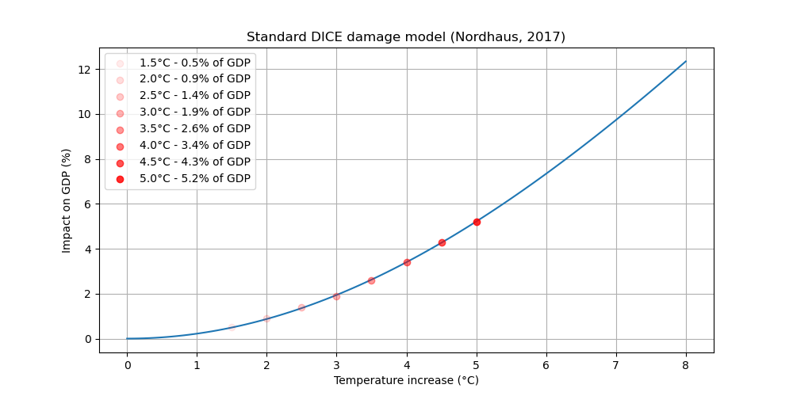
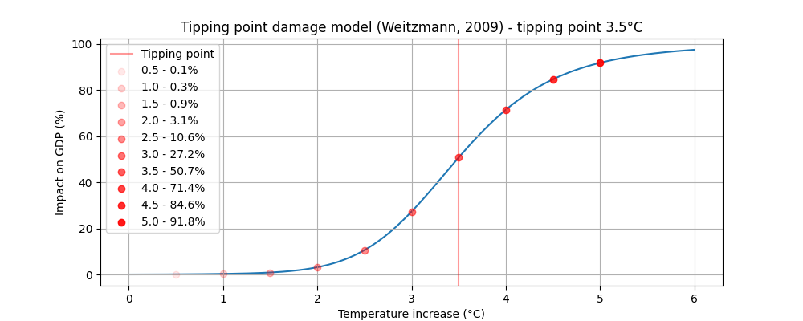
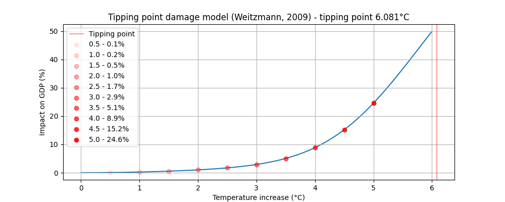

# Summary

This document explores the relationship between global warming and its impact on the economy, driven by different damage functions. It implements two equations for the damage model: the Standard DICE model and a Tipping Point model. Users can choose between them by setting the `tipping_point` input. The time step and period parameters are adjustable to simulate various scenarios. Graphs illustrate the differences between the models, and references provide further reading on the subject.

# Navigation
- [Damage Functions](#damage-functions)
  - [Standard DICE Damage](#standard-dice-damage)
  - [Tipping Point](#tipping-point)
    - [Controversy on Tipping Point Value](#controversy-on-tipping-point-value)
    - [Implementation of 3.5°C Tipping Point](#implementation-of-35c-tipping-point)
- [Damage to Productivity](#damage-to-productivity)
- [References and Notes](#references-and-notes)

# Damage Functions

The relationship between global warming and its impact on the economy is driven by the damage function. We have implemented two different equations for the damage model: 
* Standard DICE: the DICE model equation [^1] 
* Tipping point: a more drastic version with damage acceleration. 
You can choose between them by changing the input `tipping_point`: if `tipping_point = False` then the standard DICE is used and if `tipping_point = True` the tipping point version is used. 

## Standard DICE Damage
In DICE[^1] model, the damage function gives a relationship between temperature increase and economic damage. The fraction of output loss due to climate change $\Omega_t$ at $t$ is: 
$$\Omega_t = \pi_1 T_{t\,AT}+ \pi_2 T_{t\,AT}^\varepsilon$$ 
where $\pi_1$ and  $\pi_2$ are `damage_int` and `damage_quad` in the inputs. $T_{t\,AT}$ is the atmospheric temperature increase (see Temperature change model documentation). $\varepsilon$ (`damage_expo`) represents the form of the relationship between temperature and economic damage. We set the default value to $\varepsilon = 2$, such that we have a quadratic relationship. It can be modified by changing the input `damage_expo`.   
Total damage in trillions of dollars is then: 
$$Damages_t = \Omega _t. Y_t$$
with $Y_t$ the gross economic output in trillions of dollars (see macroeconomics documentation). 
The form of the damage fraction in the latest version of DICE (2017) is different between the documentation[^1] and the code[^3]. We chose to implement the equation from the code which is the one used to obtain the results. 

## Tipping Point
We use another equation for the damage model from Weitzman (2009)[^2][^4] based on the assumption that once temperatures increase above a given point, damages may accelerate. In this version damages drastically increase after a temperature $T_3$ currently set to 3.5°C (more on that in next section). We have then:
$$D_t = \left(\frac{T_{t\,AT}}{20.46}\right)^2 + \left(\frac{T_{t\,AT}}{T_3}\right)^{6.754}$$
and
$$\Omega_t = \frac{D_t}{1 + D_t}$$
As before, we have the total economics damage in trillions dollars:  
$$Damages_t = \Omega _t. Y_t$$

> The severity of the damage model can be modified by adjusting the variable A3 in the GUI in expert mode (referred to as `tp_a3` in the model).

### Controversy on Tipping Point Value
The damage function significantly influences GDP and policy making. The DICE model and other IAMs traditionally do not account for tipping points, assuming these occur at 3°C or higher or over a 300-year timescale. This conservative approach has been criticized for underestimating climate change impacts.

The macroeconomics model is highly dependent on the damage model which is highly sensitive to the 
tipping point temperature (when using the tipping point damage function, which is currently the case). This original value of `tp_a3 = 6.081°C` in Weitzman's model was taken from a subjective probability 
estimate among 52 experts of triggering a « tipping point of major changes » in each of five possible 
categories: 
1. The Atlantic meridional overturning circulation (AMOC)
2. The Greenland ice sheet
3. West Antarctic Ice Sheet
4. Amazon rainforest
5. El Nino/southern Oscillation 

At $T_{t\,AT}=6.081°C$, the expected probability is 3/5 [^4].

However, that original tipping point value of 6.081°C has been critiqued for several reasons:

- **Criticism of Existing Models**: Keen et al. (2021) argue that conservative models misinform climate policy and should be rejected [^7].
- **Underestimation of Climate Change Costs**: Higher tipping points have led IAMs to underestimate the social cost of carbon and overestimate the cost of emission reductions, resulting in suboptimal climate policies[^7][^12].
- **Call for Realistic Assumptions**: Correcting these errors suggests economic damages from climate change could be much worse than forecasted, necessitating immediate and realistic consideration of lower tipping points[^12].

Some paper suggest radically different values :
- $T_{3}=3°C$  [^5] (p.34) 
- $T_{3}=1-2°C$ [^6][^7].

### Implementation of 3.5°C Tipping Point

To provide a more accurate representation of climate-economic impacts, we have adjusted the tipping point value from 6.081°C to 3.5°C. This reflects a more immediate and realistic threshold for accelerated climate damages, aligning the model with current scientific understanding and expert warnings.

# Damage to Productivity 
See the documentation of macroeconomics model. 

# References and Notes 
[^1]: Nordhaus, W. D. (2017). Revisiting the social cost of carbon. Proceedings of the National Academy of Sciences, 114(7), 1518-1523.

[^2]: Weitzman, M. L. (2009). On modeling and interpreting the economics of catastrophic climate change. The Review of Economics and Statistics, 91(1), 1-19.

[^3]: Version of the code we use is "DICE-2016R-091916ap.gms" available at https://sites.google.com/site/williamdnordhaus/dice-rice. In the documentation (see [^1] ) $\Omega_t = \frac{1}{1+\pi_1 T_{t\,AT}+ \pi_2 T_{t\,AT}^\varepsilon}$.

[^4]: Weitzman, M. L. (2012). GHG targets as insurance against catastrophic climate damages, National Bureau of Economic research (https://www.nber.org/system/files/working_papers/w16136/w16136.pdf )

[^5]: Stern, Nicholas and Stiglitz, Joseph E, The social cost of carbon, risk, distribution, market failures: An alternative approach, volume 15, 2021, National Bureau of Economic Research Cambridge, MA, USA (https://files.static-nzz.ch/2021/4/26/7e32b21f-81b9-4033-907c-7aaeba85e7a5.pdf)

[^6]: Lenton TM, Rockström J, Gaffney O et al., Climate tipping points — too risky to bet against, Nature, 19 dec 2019 (https://ore.exeter.ac.uk/repository/bitstream/handle/10871/40141/Lenton_Nature%20Comment_accepted_version.pdf?sequence=2 )

[^7]: Keen, S et al, Economists' erroneous estimates of damages from climate change, Aug 2021, the Royal Society, (https://arxiv.org/pdf/2108.07847.pdf?trk=public_post_comment-text )

[^8] Weitzman, M, GHG targets as insurance against catastrophic climate damages, National Bureau of Economic research, 2012 (https://www.nber.org/system/files/working_papers/w16136/w16136.pdf )

[^9] Kriegler, Elmar, Jim W. Hall, Hermann Held, Richard Dawson, Hans Joachim Schnellnhuber. Imprecise probability assessment of tipping points in the climate system. Proceedings of the National Academy of Sciences, 106, 5041-5046 (31 March, 2009) 

[^10] DeCanioS, 2003 Economic models of climate change: a critique. Springer

[^11] Drijfhout, S.  et al, Catalogue of abrupt shifts in Intergovernmental Panel on Climate Change climate models, Proceedings of the National Academy of Sciences, vol 112, nb 43, p.E5777--E5786, 2015, National Acad Sciences. (https://www.pnas.org/doi/full/10.1073/pnas.1511451112 )

[^12] Hänsel et al, Climate economics support for the UN climate targets (https://eprints.lse.ac.uk/105699/1/Climate_economics_support_for_the_UN_climate_targets_2.pdf )

[^13] Keen, S. (2020), The appallingly bad neoclassical economics of climate change, Globalizations, DOI 10.1080/14747731.2020.1807856   (https://doi.org/10.1080/14747731.2020.1807856  )
