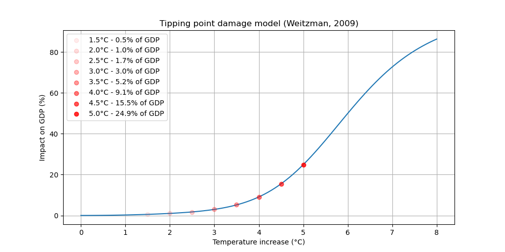

## Damage

The relationship between global warming and its impact on economy is driven by the damage function. We have implemented two different equations for the damage model:

- Standard DICE: the DICE model equation [^1]
- Tipping point: a more drastic version with damage acceleration.
  You can choose between them by changing the input $tipping\_point$: if $tipping\_point = False$ then the standard DICE is used and if $tipping\_point = True$ the tipping point version is used.

### Time Step

The time step $t$ in each equation represents the period we are looking at. All inputs data are initialized from a year 2020 reference. The user can choose the year end and the duration of the period (in years) by changing the parameters $year\, end$ and $time \,step$. For example, for a year start at 2020, year end in 2100 and a duration of time step of 5 years we have $t \, \epsilon \,[0, 16]$.

### Standard DICE Damage

In DICE[^1] model, the damage function gives a relationship between temperature increase and economic damage. The fraction of output loss due to climate change $\Omega_t$ at $t$ is:
$$\Omega_t = \pi_1 T_{t\,AT}+ \pi_2 T_{t\,AT}^\varepsilon$$
where $\pi_1$ and $\pi_2$ are $damage\_int$ and $damage\_quad$ in the inputs. $T_{t\,AT}$ is the atmospheric temperature increase (see Temperature change model documentation). $\varepsilon$ ($damag\_expo$) represents the form of the relationship between temperature and economic damage. We set the default value to $\varepsilon = 2$, such that we have a quadratic relationship. It can be modified by changing the input $damag\_expo$.
Total damage in trillions of dollars is then:
$$Damages_t = \Omega _t. Y_t$$
with $Y_t$ the gross economic output in trillions of dollars (see macroeconomics documentation).
The form of the damage fraction in the latest version of DICE (2017) is different between the documentation[^1] and the code[^3]. We chose to implement the equation from the code which is the one used to obtain the results.

### Tipping point

We use another equation for the damage model from Weitzman (2009)[^2][^4] based on the assumption that once temperatures increase above a given point, damages may accelerate. In this version damages drastically increase after a temperature increase of 6°C. We have then:

$$ D*t = (\frac{T*{t\,AT}}{20.46})^2 + (\frac{T\_{t\,AT}}{6.081})^{6.754} $$
and

$$\Omega_t = \frac{D_t}{1 + D_t}$$
As before, we have the total economics damage in trillions dollars:
$$Damages_t = \Omega _t. Y_t$$

The macroeconomics model is highly dependent on the damage model which is highly sensitive to the
tipping point temperature. This original value of tp*a3 = 6.081°C was taken from a subjective probability
estimate among 52 experts of triggering a « tipping point of major changes » in each of five possible
categories: (1) The Atlantic meridional overturning circulation; (2) the Greenland ice sheet;
(3) the West Antartic Ice Sheet; (4) the Amazon rainforest; (5) The El Nino/southern Oscillation.
At $T*{t\,AT}=6°C$, the expected probability is 3/5 [^4].
Actually, tipping cascades could occur for $T_{t\,AT}=3°C$ [^5] (p.34) or even 1-2°C [^6][^7].
Therefore, the sensitivity of the damage model to the tipping point temperature value can be studied
by adjusting the variable A3 in the GUI in expert mode (referred to as tp_a3 in the model).

## Graphs

### Damage to productivity

See the documentation of macroeconomics model.

### References and notes

[^1]: Nordhaus, W. D. (2017). Revisiting the social cost of carbon. Proceedings of the National Academy of Sciences, 114(7), 1518-1523.

[^2]: Weitzman, M. L. (2009). On modeling and interpreting the economics of catastrophic climate change. The Review of Economics and Statistics, 91(1), 1-19.

[^3]: Version of the code we use is "DICE-2016R-091916ap.gms" available at <https://sites.google.com/site/williamdnordhaus/dice-rice>. In the documentation (see [^1] ) $\Omega_t = \frac{1}{1+\pi_1 T_{t\,AT}+ \pi_2 T_{t\,AT}^\varepsilon}$.

[^4]: Weitzman, M. L. (2012). GHG targets as insurance against catastrophic climate damages, National Bureau of Economic research (<https://www.nber.org/system/files/working_papers/w16136/w16136.pdf> )

[^5]: Stern, Nicholas and Stiglitz, Joseph E, The social cost of carbon, risk, distribution, market failures: An alternative approach, volume 15, 2021, National Bureau of Economic Research Cambridge, MA, USA (<https://files.static-nzz.ch/2021/4/26/7e32b21f-81b9-4033-907c-7aaeba85e7a5.pdf>)

[^6]: Lenton TM, Rockström J, Gaffney O et al., Climate tipping points — too risky to bet against, Nature, 19 dec 2019 (<https://ore.exeter.ac.uk/repository/bitstream/handle/10871/40141/Lenton_Nature%20Comment_accepted_version.pdf?sequence=2> )

[^7]: Keen, S et al, Economists' erroneous estimates of damages from climate change, Aug 2021, the Royal Society, (<https://arxiv.org/pdf/2108.07847.pdf?trk=public_post_comment-text> )
