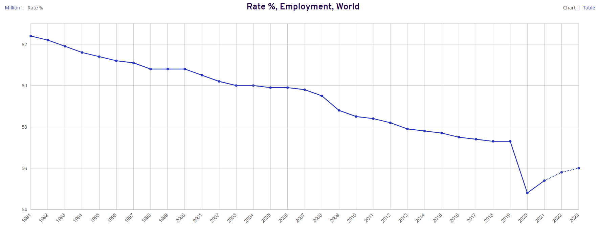

## Macroeconomics model
### Main Inputs 
- Damage data ($damage\_df$): Dataframe with damage fraction to be applied to output 
- Working age population ($working\_age\_population\_df$): Dataframe with working age population per year in million of people
- Population df ($population\_df$): Dataframe with total population per year in millions of people
- Energy Production Quantity ($energy\_production$): Dataframe with Total Final Consumption of energy per year in Pwh
- Energy capital ($energy\_capital$): Dataframe with the total capital stock dedicated to energy production per year. Unit: trillion dollars. 
- Shares of investment in  ($energy$ and $non\ energy$): Share of total investment that goes to energy sector and non-energy sectors
- Damage to productivity ($damage\_to\_productivity$): If True: apply damage to productivity. if False: Apply damage only to production. 
- CO2 Emissions: Dataframe with C02 emissions per year in Gt 
- C02 taxes($CO2\_taxes$): C02 taxes per year in\$/tC02 
- Initial rate of time preference ($init\_rate\_time\_pref$)
  
### Outputs 
- Economics detail df ($economics\_detail\_df$): Dataframe with most of model outputs
- Economics Data ($economics\_df$): Dataframe with coupling model outputs from previous dataframe. It contains gross output and net output in trillion dollars and consumption per capita in k\$.
- Energy investment by year ($energy\_investment$): the investment in energy by year in G\$. 
- Per capita consumption constraint ($pc\_consumption\_constraint$): Value of the per capita consumption constraint for the optimization
- Energy invests wo renewable: Energy investment without additional investment coming from carbon tax. Unit: G\$
- Workforce df ($workforce\_df$): Dataframe with workforce per year in million of people. 
- Usable capital df ($usable\_capital\_df$): Dataframe with the usable capital in trillion dollars and the intermediate parameters (e_max, energy_efficiency).

                    
### Time Step 
The time step $t$ in each equation represents the period we are looking at. In the inputs we initialize the data with 2020 information. 

### Global output
#### Usable capital 
Global output is calculated from a production function. Here, it is a different one from DICE model[^1] (Nordhaus, 2017) because we want to include energy as a key element in the production process. One way to do so is by directly including energy production as production factor in the production function. We chose a different option as we wanted to take this aspect into account but not to under consider the importance of labor and capital in the production process. It is the combination of capital and energy that generates the most production. Capital without energy is almost useless. It is mandatory to feed the capital with energy for it to be able to produce output such as having fuel for trucks to transport goods, or electricity for robots in factories.   
For this reason the notion of usable capital ($Ku$) has been introduced that depends on the capital ($K\_ne$) and the net energy output ($En$). 
Moreover, the capital is not able to absorb more energy that it is built for,  thus the notion of maximum usable energy of capital ($E\_max\_k$) is also introduced. 
$$Ku=Kne \cdot \frac{En}{E\_max\_k}$$
with $Kne$ non energy capital stock in trillions dollars (see capital section for more explaination) and $En$ the net energy supply in TWh.   
The maximum usable energy of capital ($E\_max\_k$) energy evolves with technology evolution as well as the productivity of the capital ($P$):
 $$E\_max\_k = \frac{Kne}{capital\_utilisation\_ratio \cdot P}$$
 with $capital\_utilisation\_ratio$ the capital utilisation rate and P the productivity of the capital represented by a logistic function: 
 $$P = min\_value+ \frac{L}{1+e^{-k(year-xo)}}$$
 with L is $energy\_eff\_max$ in the inputs, $min\_value$ is $energy\_eff\_cst$, $xo$ is $energy\_eff\_xzero$, and $k$ $energy\_eff\_k$.  

#### Gross Output 
From the definition of the usable capital ($Ku)$ a standard constant elasticity of substitution (CES) function from classical economy is used to compute the GDP ($Y$): 
$$Y = A \cdot (\alpha \cdot Ku^{\gamma} + (1-\alpha) \cdot L^\gamma)^{\frac{1}{\gamma}}$$
$A$ the Total Factor Productivity (TFP), $L$ the labor force in million of people $\alpha \in (0,1)$ the share parameter reflecting the capital intensity in production, $\gamma$ the substitution parameter. $\gamma = \frac{\sigma-1}{\sigma}$ where $\sigma$ is the elasticity of substitution between capital and labor.

#### Net output 
Net output $Q$ is the output net of climate damage:
$$Q_t = (1- \Omega_t )Y_t$$
with $\Omega$ is the damage fraction of output explained in the documentation of the damage model.  

### Productivity
The Total factor productivity (TFP) measures the efficiency of the inputs in the production process. The initial values of the productivity and productivity growth rate are obtained during the fitting of the production function. For the TFP we have 2 options: 
* The standard DICE ($damage\,to\,productivity$ = $False$) where $A_t$ evolves according to:
$$A_t = \frac{A_{t-1}}{1-A_{gt-1}}$$ with $A_g$ the productivity growth rate.
The initial level $A_0$ can ben changed in the inputs ($productivity\_start$),
$$A_{gt}=A_{g0} \cdot exp(-\Delta_a \cdot (t-1) \cdot time\_step)$$
and $\Delta_a$ is the percentage growth rate of $A_g$.
* The “Damage to productivity growth” one ($damage\,to\,productivity$ = $True$) comes from Moyer et al. (2014) [^4]. It applies a fraction of damage $f$ ($frac\_damage\_prod$) to the productivity instead of all damage being applied to output:
$$A^*_t=(1-f\Omega_t) \cdot \frac{A^*_{t-1}}{1-A_{gt-1}}$$ with $A_0 =A^*_0$.  
and then damage to output $\Omega_{yt}$ becomes: 
$$\Omega_{yt} = 1- \frac{1- \Omega_t}{1-f\Omega_t}$$
such that the output net of climate damage is 
$$Q^*_t = (1-\Omega_{yt}) \cdot Y_t (Ku_t, L_t)$$

### Labor force 
To obtain the labor force we use the population in working age and the employment rate. We defined the population in working age as the population in the 15-70 age range. 
$$L = working\_age\_pop * employment\_rate$$
The employment rate is for now fixed at  $65.9\%$ following International Labour Organization data[^9]. However to take into account the impact of COVID-19 crisis on employment rate, the value is different for 2020-2031 year interval. We used ILO forecast values for 2021, 2022 and 2023 to extrapolate a recovery function until fixed value is reached.   
|  | 
|:--:| 
| *International Labour Organization Employment rate. Copyright International Labor Organization* |
*Note*: The ILO value of employment rate is different from ours because on the graph the employment rate of the total population is represented (number of people employed/ total population) and we use the employment rate for 15-70 population (number of employed people/ working_age_pop)

### Capital
The capital equation is: 
$$K_t = I_t + (1- \delta )K_{t-1}$$
with $I_t$ the investment in trillions dollars, and $\delta$ the depreciation rate. Each period the capital stock increases with new investment and decreases with depreciation of past period capital.  
The capital is divided into two types: energy capital and non energy capital. Energy capital is the capital dedicated to energy production. The remaining capital stock is then the non-energy capital.   
The equation above is applied to both energy and non energy capital, the total capital stock being the sum. We apply to non energy capital the depreciation rate in input ($depreciation\_rate$) of this model. For energy capital the depreciation rate depends on the technology, the energy capital is therefore computed in each energy technology model and is an input of the macroeconomics model.  

### Investment
Investment $I_t$ is defined using the inputs $I^E_{raw}$ and $share\ non\ energy\ investements$, which respectively are 
direct investments in the energy sector (not resulting from CO2 tax, also called "without tax") and the share percentage of the net GDP output allowed to other sectors.

The investment in energy $I^E$ is:
$$I^E = I^E_{raw} + I^E_{from CO2 tax}$$
With:
$$I^E_{from CO2 tax} = emissions \cdot co2\_taxes \cdot co2\_tax\_eff$$
However, investments in energy coming from CO2 taxes are capped at the value of energy investment without tax multiplied by the model input factor co2_input_limit. It is 2 by default and smoothed with the following formula:
$$ren\_investments = co2\_invest\_limit \cdot \frac{energy\_investment\_wo\_tax}{10} \cdot(9.0 + e^{- \frac{co2\_invest\_limit \cdot energy\_investment\_wo\_tax}{ren\_investments}})$$

The investment in non-energy $I^{NE}$ is :  
$$I_{t}^{NE} = share\_non\_energy\_investment_t \cdot Q_t$$ 
and the total investment $$I_t =  I_t^E + I_t^{NE}$$ is limited to a certain share of the net output set by $max\_invest$ input. 

### Consumption
Consumption is such that: 
$$C_t = Q_t - I_t$$
The part of the net output not invested is used for consumption. 

### Notes on the fitting of the production function
To obtain the value of the production function parameters we fitted our calculated production to historical data from IMF[^5] of GDP PPP (Purchasing Power Parity) in current US dollars that we calibrated to be in constant 2020 US dollars using the GDP deflator. We also used data from the IMF[^6] for the capital stock value, for population we took data from the World Bank databank[^7] and lastly for energy we used Total Final Consumption from International Energy Agency[^10].

### Other inputs 
-  Year start, year end and time step 
- Parameters for production function: output_alpha,  output_gamma
- parameters for productivity function: productivity_start, productivity_gr_start, decline_rate_tfp
- Non Energy capital at year start in trillion dollars ($capital\_start\_non\_energy$)
- Output at year start $(init\_gross\_output$) in trillion dollars
- Usable capital parameters: capital_utilisation_ratio, $energy\_eff\_k$, $energy\_eff\_cst$, $energy\_eff\_xzero$, $energy\_eff\_max$
- Capital depreciation rate 
- Elasticity of consumption
-  Lower bounds for capital, consumption, per capita consumption
-  Productivity damage fraction: Fraction of damage applied to productivity
-  Initial output growth rate
-  C02 tax efficiency: how much of the co2 tax can be reinvested (\%)
-  Employment rate recovery function parameters: $employment\_a\_param$, $employment\_power\_param$, $employment\_rate\_base\_value$

## References

[^4]: Moyer, E. J., Woolley, M. D., Matteson, N. J., Glotter, M. J., & Weisbach, D. A. (2014). Climate impacts on economic growth as drivers of uncertainty in the social cost of carbon. The Journal of Legal Studies, 43(2), 401-425.

[^1]: Nordhaus, W. D. (2017). Revisiting the social cost of carbon. Proceedings of the National Academy of Sciences, 114(7), 1518-1523.

[^5]: International Monetary Fund. (2020). World Economic Outlook Database. Available at: https://www.imf.org/en/Publications/WEO/weo-database/2020/October

[^6]: International Monetary Fund. (2019)  Investment and Capital Stock Dataset.

[^7]: World Bank.[ World data bank: https://databank.worldbank.org/reports.aspx?source=2&series=NY.GDP.MKTP.KD&country=](https://data.worldbank.org/)

[^8]: GHDx, (2020) Global Fertility, Mortality, Migration, and Population Forecasts 2017-2100, Available at: http://ghdx.healthdata.org/record/ihme-data/global-population-forecasts-2017-2100

[^9]: International Labour Organization, ILOSTAT database. Data retrieved on February 8, 2022.

[^10]: IEA 2022; World total final consumption by source, https://www.iea.org/reports/key-world-energy-statistics-2020/final-consumption, License: CC BY 4.0. 