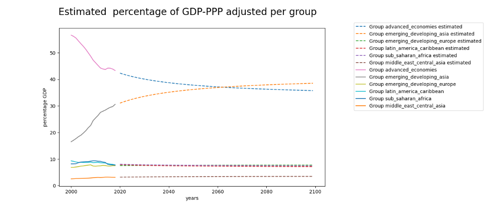

## Macroeconomics model
### Main Inputs 
- Damage data ($damage\_df$): dataframe with damage fraction to be applied to output 
- Working age population ($working\_age\_population\_df$): dataframe with working age population per year in million of people
- Population df ($population\_df$): dataframe with total population per year in million of people
- Energy Production Quantity ($energy\_production$): dataframe with Total Final Consumption of energy per year in Pwh
- Energy capital ($energy\_capital$): dataframe with the total capital stock dedicated to energy production per year. Unit: trillion dollars. 
- Shares of investment in  ($energy$ and $non\ energy$): share of total investment that goes to energy sector and non-energy sectors
- Damage to productivity ($damage\_to\_productivity$): if True: apply damage to productivity. If False: Apply damage only to production. 
- CO2 Emissions: dataframe with C02 emissions per year in Gt 
- C02 taxes($CO2\_taxes$): C02 taxes per year in\$/tC02 
- Initial rate of time preference ($init\_rate\_time\_pref$)
- Sector list ($sector\_list$): list of sectors
- Section list ($section\_list$): list of all sub-sectors
- Percentage of gdp per section ($section\_gdp\_percentage\_df$): dataframe with the gdp percentage of all sub_sectors 
  
### Outputs 
- Economics detail df ($economics\_detail\_df$): dataframe with most of model outputs
- Economics Data ($economics\_df$): dataframe with coupling model outputs from previous dataframe. It contains gross output and net output in trillion dollars and consumption per capita in k\$.
- Energy investment by year ($energy\_investment$): the investment in energy by year in G\$. 
- Per capita consumption constraint ($pc\_consumption\_constraint$): value of the per capita consumption constraint for the optimization
- Energy invests wo renewable: energy investment without additional investment coming from carbon tax. Unit: G\$
- Workforce df ($workforce\_df$): dataframe with workforce per year in million of people. 
- Usable capital df ($usable\_capital\_df$): dataframe with the usable capital in trillion dollars and the intermediate parameters (e_max, energy_efficiency).
- Section gdp ($detailed\_section\_gdp$): dictionary with the gdp value of each sub-sector in T\$.
                    
### Time Step 
The time step $t$ in each equation represents the period we are looking at. In the inputs we initialize the data with 2020 information. 

### Global output
#### Usable capital 
Global output is calculated from a production function. Here, it is a different one from DICE model[^1] (Nordhaus, 2017) because we want to include energy as a key element in the production process. One way to do so is by directly including energy production as production factor in the production function. We chose a different option as we wanted to take this aspect into account but not to under consider the importance of labor and capital in the production process. It is the combination of capital and energy that generates the most production. Capital without energy is almost useless. It is mandatory to feed the capital with energy for it to be able to produce output such as having fuel for trucks to transport goods, or electricity for robots in factories.   
For this reason the notion of usable capital ($Ku$) has been introduced that depends on the capital ($K\_ne$) and the net energy output ($En$). 
Moreover, the capital is not able to absorb more energy that it is built for,  thus the notion of maximum usable energy of capital ($E\_max\_k$) is also introduced. 
$$Ku=Kne \cdot \frac{En}{E\_max\_k}$$
with $Kne$ non energy capital stock in trillions dollars (see capital section for more explaination) and $En$ the net energy supply in TWh.   
The maximum usable energy of capital ($E\_max\_k$) energy evolves with technology evolution as well as the productivity of the capital ($P$):
 $$E\_max\_k = \frac{Kne}{capital\_utilisation\_ratio \cdot P}$$
 with $capital\_utilisation\_ratio$ the capital utilisation rate and P the productivity of the capital represented by a logistic function: 
 $$P = min\_value+ \frac{L}{1+e^{-k(year-xo)}}$$
 with L is $energy\_eff\_max$ in the inputs, $min\_value$ is $energy\_eff\_cst$, $xo$ is $energy\_eff\_xzero$, and $k$ $energy\_eff\_k$.  

#### Gross Output 
From the definition of the usable capital ($Ku)$ a standard constant elasticity of substitution (CES) function from classical economy is used to compute the GDP ($Y$): 
$$Y = A \cdot (\alpha \cdot Ku^{\gamma} + (1-\alpha) \cdot L^\gamma)^{\frac{1}{\gamma}}$$
$A$ the Total Factor Productivity (TFP), $L$ the labor force in million of people $\alpha \in (0,1)$ the share parameter reflecting the capital intensity in production, $\gamma$ the substitution parameter. $\gamma = \frac{\sigma-1}{\sigma}$ where $\sigma$ is the elasticity of substitution between capital and labor.

#### Net output 
Net output $Q$ is the output net of climate damage:
$$Q_t = (1- \Omega_t )Y_t$$
with $\Omega$ is the damage fraction of output explained in the documentation of the damage model.  

### Productivity
The Total Factor Productivity (TFP) measures the efficiency of the inputs in the production process. The initial values of the productivity and productivity growth rate are obtained during the fitting of the production function. For the TFP we have 2 options: 
* The standard DICE ($damage\,to\,productivity$ = $False$) where $A_t$ evolves according to:
$$A_t = \frac{A_{t-1}}{1-A_{gt-1}}$$ with $A_g$ the productivity growth rate.
The initial level $A_0$ can ben changed in the inputs ($productivity\_start$),
$$A_{gt}=A_{g0} \cdot exp(-\Delta_a \cdot (t-1) \cdot time\_step)$$
and $\Delta_a$ is the percentage growth rate of $A_g$.
* The productivity with damage (when $damage\,to\,productivity$ = True$) is 
$$A^*_t=(1-\Omega_t) \cdot \A_t$,  
and then damage to output $\Omega_{yt}$ becomes: 
$$\Omega_{yt} = 1- \frac{1- \Omega_t}{1-f\Omega_t}$$
such that the output net of climate damage is 
$$Q^*_t = (1-\Omega_{yt}) \cdot Y_t (Ku_t, L_t)$$

## Damages
Damages are computed as the sum of immediate climate damages + damage from loss of productivity

#### Immediate climate damages

Coming from Damage Discipline, the input $\Omega$ represents the fraction of the gross output that is wasted as damages from climate,

Therefore, when applied, the damage from climate are computed as :

$$D^{climate}_t = \Omega_t Y_t$$

#### Damages from productivity loss

When damage to productivity is on,

$$D^{productivity\ loss}_t = Y_t \times  \frac{A_t - A^{\star}_t}{A_t}$$

where $A$ is the productivity without damage and $A^{\star}$ is productivity with damage (see above section on productivity computation).

### Labor force 
To obtain the labor force we use the population in working age and the employment rate. We defined the population in working age as the population in the 15-70 age range. 
$$L = working\_age\_pop * employment\_rate$$
The employment rate is for now fixed at  $65.9\%$ following International Labour Organization data[^9]. However to take into account the impact of COVID-19 crisis on employment rate, the value is different for 2020-2031 year interval. We used ILO forecast values for 2021, 2022 and 2023 to extrapolate a recovery function until fixed value is reached.   
|  | 
|:--:| 
| *International Labour Organization Employment rate. Copyright International Labor Organization* |
*Note*: The ILO value of employment rate is different from ours because on the graph the employment rate of the total population is represented (number of people employed/ total population) and we use the employment rate for 15-70 population (number of employed people/ working_age_pop)

### Capital
The capital equation is: 
$$K_t = I_t + (1- \delta )K_{t-1}$$
with $I_t$ the investment in trillions dollars, and $\delta$ the depreciation rate. Each period the capital stock increases with new investment and decreases with depreciation of past period capital.  
The capital is divided into two types: energy capital and non energy capital. Energy capital is the capital dedicated to energy production. The remaining capital stock is then the non-energy capital.   
The equation above is applied to both energy and non energy capital, the total capital stock being the sum. We apply to non energy capital the depreciation rate in input ($depreciation\_rate$) of this model. For energy capital the depreciation rate depends on the technology, the energy capital is therefore computed in each energy technology model and is an input of the macroeconomics model.  

### Investment
Investment $I_t$ is defined using the inputs $I^E_{raw}$ and $share\ non\ energy\ investements$, which respectively are direct investments in the energy sector (not resulting from CO2 tax, also called "without tax") and the share percentage of the net GDP output allowed to other sectors.

The investment in energy $I^E$ is:
$$I^E = I^E_{raw} + I^E_{from CO2 tax}$$
with:
$$I^E_{from CO2 tax} = emissions \cdot co2\_taxes \cdot co2\_tax\_eff$$
However, investments in energy coming from CO2 taxes are capped at the value of energy investment without tax multiplied by the model input factor co2_input_limit. It is 2 by default and smoothed with the following formula:
$$ren\_investments = co2\_invest\_limit \cdot \frac{energy\_investment\_wo\_tax}{10} \cdot(9.0 + e^{- \frac{co2\_invest\_limit \cdot energy\_investment\_wo\_tax}{ren\_investments}})$$

The investment in non-energy $I^{NE}$ is :  
$$I_{t}^{NE} = share\_non\_energy\_investment_t \cdot Q_t$$ 
and the total investment $$I_t =  I_t^E + I_t^{NE}$$ is limited to a certain share of the net output set by $max\_invest$ input. 

### Consumption
Consumption is such that: 
$$C_t = Q_t - I_t$$
The part of the net output not invested is used for consumption. 

### Notes on the fitting of the production function
To obtain the value of the production function parameters we fitted our calculated production to historical data from IMF[^5] of GDP PPP (Purchasing Power Parity) in current US dollars that we calibrated to be in constant 2020 US dollars using the GDP deflator. We also used data from the IMF[^6] for the capital stock value, for population we took data from the World Bank databank[^7] and lastly for energy we used Total Final Consumption from International Energy Agency[^10].

### Other inputs 
-  Year start, year end and time step 
- Parameters for production function: $output\_alpha$,  $output\_gamma$
- parameters for productivity function: $productivity\_start$, $productivity\_gr\_start$, $decline\_rate\_tfp$
- Non Energy capital at year start in trillion dollars ($capital\_start\_non\_energy$)
- Output at year start $(init\_gross\_output$) in trillion dollars
- Usable capital parameters: $capital\_utilisation_\_ratio$, $energy\_eff\_k$, $energy\_eff\_cst$, $energy\_eff\_xzero$, $energy\_eff\_max$
- Capital depreciation rate 
- Elasticity of consumption
-  Lower bounds for capital, consumption, per capita consumption
-  Productivity damage fraction: Fraction of damage applied to productivity
-  Initial output growth rate
-  C02 tax efficiency: how much of the co2 tax can be reinvested (\%)
-  Employment rate recovery function parameters: $employment\_a\_param$, $employment\_power\_param$, $employment\_rate\_base\_value$

### GDP-PPP adjusted per country estimation 
The GDP distribution model is a predictive model developed to estimate the distribution of Gross Domestic Product (GDP) 
adjusted to Purchasing Power Parity (PPP) among different countries over time. 
The ultimate goal of this model is to provide insights into the future GDP-PPP adjusted distribution based on the computed GDP-PPP adjusted in the macroeconomics discipline.

#### Strategy :
- **Grouping** : The model is based on the group of countries from the International Monetary Fund (IMF)[^11]. The used groups are : 
Advanced Economies, Emerging and Developing Europe, Emerging and Developing Asia, Latin America and the Caribbean, Sub-Saharan Africa, 
Middle East and Central Asia. 
- **Analysis of variability** : We've computed the mean and the standard deviation of each country's GDP-PPP adjusted share within its group.
This analysis helps determine the stability and variability of countries' contributions to their respective groups. 
- **Linear Regression Model** : A linear model is developed to estimate the GDP-PPP adjusted for each group over time. This model utilizes 
official GDP data spanning from 2000 to 2020 per group. Its primary purpose is to calculate the weight of each group in the total GDP.
The linear regression model is formulated as : $$GDP_{group} = a \times Years + b$$ 
Where : 
  - **GDP_{group}** represents the GDP-PPP adjusted for a specific group.
  - **Years** years for which GDP is being estimated.
  - **a** is the slope parameter representing the change in GDP over time.
  - **b** is the intercept parameter.

This formula is used to estimate the GDP-PPP adjusted for each group over time. The primary purpose is to calculate the GDP-PPP adjusted for each group,
which is then used to determine the percentage of GDP-PPP adjusted contributed by each group to the total GDP-PPP adjusted.
The expected is result of the model is :

|  | 

- **Projection of GDP-PPP adjusted by Group** : Using the output from the linear regression model, the GDP-PPP adjusted share for each group is projected into the future. 
This provides an estimate of the GDP in Trillions of dollars ($T) for each group for upcoming years using the computed GDP-PPP adjusted in macroeconomics.
- **Allocation of GDP-PPP adjusted to countries** : Finally the GDP-PPP adjusted projected for each group is allocated among its constituent countries. 
The allocation is based on the average weight of each country within its group. The result is the GDP-PPP adjusted for each country for each year.
Note: Preprocessing of data and the computation of the parameters of the linear regression were calculated in a separate file. 
These computations are available in the Jupyter Notebook in data folder "GDP_data_preprocessing_model.ipynb".

## Compute energy and non energy emissions per sector and section 

This model provides functionality for analyzing energy consumption and both energy and non energy emissions data across different sectors of the economy. 
It computes the energy consumption and associated emissions in addition of non energy emissions for the different sectors and the composing sections.

### Used Inputs :
- **Percentage Energy Consumption Data**: Dataframes detailing the percentage breakdown of energy consumption for each sector and then for each section in the sectors.
- **Carbon Intensity Data**: Dataframe containing carbon intensity, value expressed in kgCO2Eq/kWh
- **Non-energy emissions data per section** Dataframe per sector detailing non energy related emissions per section, value expressed in tCO2eq/M$ (emissions per millions dollars GDP)

### Outputs:

- **Detailed Energy Consumption and Emissions Data per Sector**: Dictionaries containing detailed dataframes for energy consumption and emissions per sector. These dataframes include information on energy usage and emissions for various subcategories or sections within each sector, along with the corresponding years.
- **Total Energy Consumption and Emissions Data per Sector**: Summary dataframes providing the total energy consumption and emissions for each sector, aggregated over all subcategories or sections within the sector.
- **Total Non-Energy Emissions Data per Sector and Section**: Summary dataframes presenting the total non-energy-related emissions for each sector and its subsections, aggregated over the corresponding economic data.
- **Total Energy Consumption and Emissions Data Across All Sectors**: Summary dataframes presenting the total energy consumption and emissions across all sectors of the economy, aggregated from the detailed data per sector.

### Formulas and Units:

- **Energy Consumption**: Energy consumption per section is computed using the formula:  
$\text{Energy Consumption} = \text{Total Production} \times \text{Percentage Energy Consumption}$

  The units for energy consumption are typically TWh (terawatt-hours).

- **Energy Emissions**: Energy-related emissions are computed by multiplying energy consumption by carbon intensity values. The resulting emissions are typically in units of mega tons of CO2 (MtCO2).

- **Non-Energy Emissions**: Non-energy-related emissions are calculated by multiplying emissions rates by GDP values. The emissions rates are typically expressed in tCO2eq/M$ (mega tons of CO2 equivalent per million dollars of economic output).

- **Total Emissions**: Total emissions are obtained by summing energy-related and non-energy-related emissions per sector. The units for total emissions are consistent with those of energy-related and non-energy-related emissions.

## References

[^4]: Moyer, E. J., Woolley, M. D., Matteson, N. J., Glotter, M. J., & Weisbach, D. A. (2014). Climate impacts on economic growth as drivers of uncertainty in the social cost of carbon. The Journal of Legal Studies, 43(2), 401-425.

[^1]: Nordhaus, W. D. (2017). Revisiting the social cost of carbon. Proceedings of the National Academy of Sciences, 114(7), 1518-1523.

[^5]: International Monetary Fund. (2020). World Economic Outlook Database. Available at: https://www.imf.org/en/Publications/WEO/weo-database/2020/October

[^6]: International Monetary Fund. (2019)  Investment and Capital Stock Dataset.

[^7]: World Bank.[ World data bank: https://databank.worldbank.org/reports.aspx?source=2&series=NY.GDP.MKTP.KD&country=](https://data.worldbank.org/)

[^8]: GHDx, (2020) Global Fertility, Mortality, Migration, and Population Forecasts 2017-2100, Available at: http://ghdx.healthdata.org/record/ihme-data/global-population-forecasts-2017-2100

[^9]: International Labour Organization, ILOSTAT database. Data retrieved on February 8, 2022.

[^10]: IEA 2022; World total final consumption by source, https://www.iea.org/reports/key-world-energy-statistics-2020/final-consumption, License: CC BY 4.0. 

[^11]: IMF World Economic Outlook, Groups and Aggregates Information https://www.imf.org/en/Publications/WEO/weo-database/2023/April/groups-and-aggregates