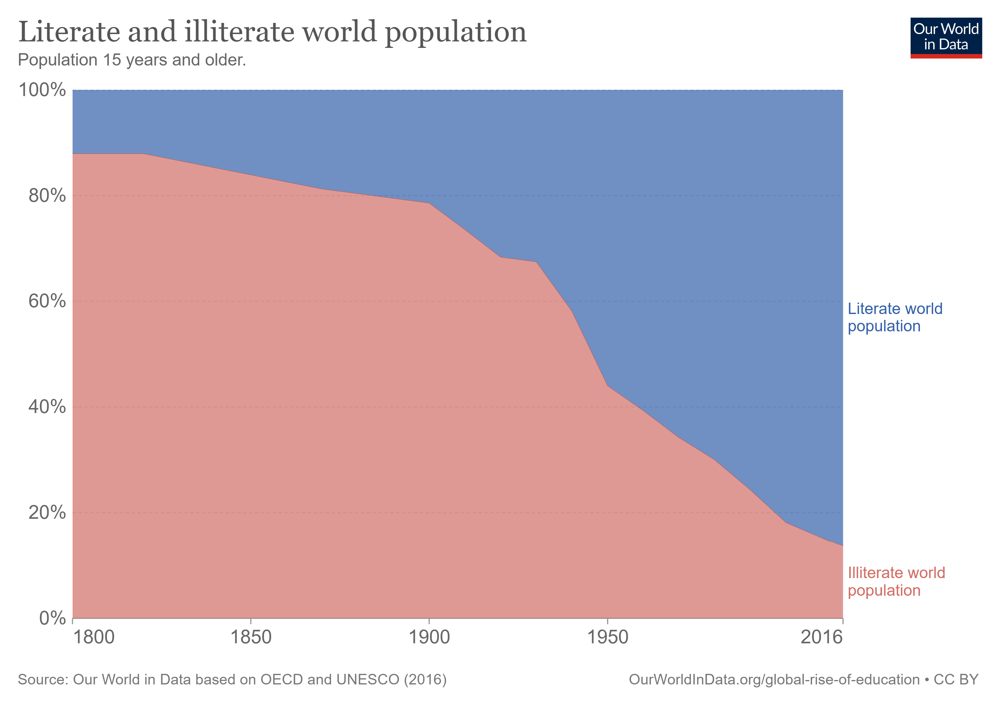
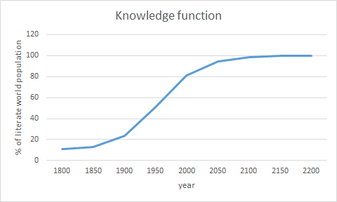
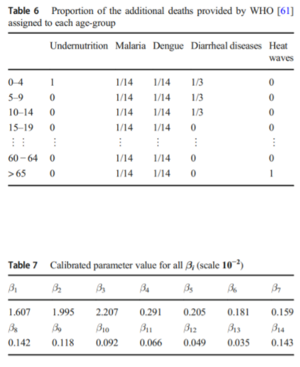
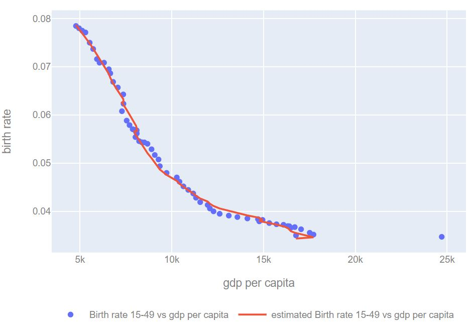
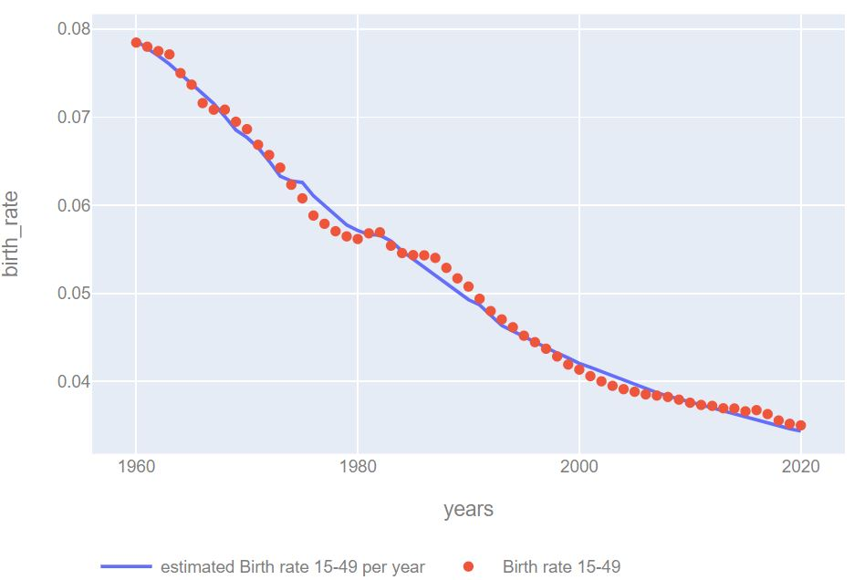
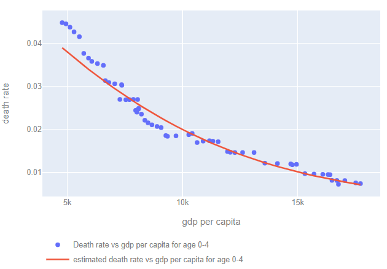

# Population model

This model is based on McIsaac (2017)[^1] to which we made modifications. First, we run the model on a one year time step instead of a five year time. We then decided to divide the population in one year age groups instead of five year age range groups. Lastly, we modified the birth rate equation by adding a new variable.

## Population dynamic
The population is divided in one year age-range from 0 to 100+ year old. Each year the population gets one year older. There is an amount of newborns that will represent the 0 age range. And there is also a certain amount of deaths per age category.
So that for the first age category $0$ year old the number of people is simply the number of newborns:
$$N_{0,t} = I_{t-1}$$
For the last category, $100+$ year old, the number of people is the amount in this category still alive from the previous year plus the 99 year old still alive from previous year:
$$N_{100 +,t} = N_{99,t-1} - D_{99, t-1} +N_{100 +,t-1} - D_{100, t-1}$$
And in each other age category $i$ at year $t$ the number of people $N$ is:
 $$N_{i,t} = N_{i-1,t-1} - D_{i-1, t-1}$$
D is the number of deaths, I the number newborns.
In order to compute the number of deaths and births we use a birth rate and a death rate.

## Birth rate
According to the United Nation definition, the  age-specific birth rate is the "number of births to women in a particular age group, divided by the number of women in that age group". In our model, we look at the birth rate for the 15-49 age group, the young active population in childbearing age.
The birth rate is then:
$$birth\_rate_{15-49, t} = \frac{I_{t}}{N_{15-49, t}}$$
The birth rate depends on Gross World Product, population and knowledge:
$$birth\_rate_{15-49, t} = a.birth\_rate(knowledge)_t + (1-a)*birth\_rate(gdp\_capita)_t$$
The fitting of this function is explained in the section below.
Compared to McIsaac (2017)[^1] we added a variable $knowledge$ to the equation. Without it, in case of economic crisis (a decrease of gdp), the birth rate increases. We argue that in case of degrowth  we will not retrieve past level of birth rate because of all the knowledge acquired including better access to contraception, higher level of education...  Therefore we need a way to include this effect in birth rate equation. To estimate our variable $knowledge$ we use the percentage of litterate world population and do a regression on this data[^8] to fit a S-curve.
 
$$knowledge_t =  know\_upper + \frac{know\_lower - know\_upper}{(1 + \exp(-\delta (t - 1800 - \phi)))^{\frac{1}{\nu}}}$$
with t the year at which we estimate the variable, 1800 the first year of the regression. $know\_upper$ and $know\_lower$ the upper and lower asymptotes, $\delta$ a slope parameter, $\phi$ is the year value determining the inflection point and $\nu$ is a parameter that controls the curvature of the function near the asymptotes.

The function looks like:
 

And then:

$$birth\_rate(knowledge)\_t = c + \alpha * (1- \frac{knowledge_t}{100})^{\beta}$$
with $c$, $\alpha$ and $\beta$ the parameters obtained by the fitting of the full birth rate function.
For the second part we follow McIsaac (2017)[^1]:
$$birth\_rate(gdp\_capita)_{15-49, t} = br\_upper + \frac{br\_lower - br\_upper}{(1 + \exp(-\delta (\frac{Y_t}{N_t}-\phi)))^{\frac{1}{\nu}}}$$
where $Y_t$ represents the GDP, $N_t$ the total population at year $t$, $br\_upper$ and $br\_lower$ the upper and lower asymptotes, $\delta$ a slope parameter, $\phi$ is the GWP/capita value determining the inflection point and $\nu$ is a parameter that controls the curvature of the function near the asymptotes.

## Death rate
The death rate is the number of deaths divided by the number of persons in a specific age category and year. The death rate for age category $i$ and year $t$ is then:
$$death\_rate_{i, t} = \frac{D_{i, t}}{N_{i, t}}$$
with D the number of death and N the population.
Following McIsaac (2017)[^1], and similarly to birth rate, the death rate per age category $i$  and year $t$ depends on Gross World Product and on population so that:
$$death\_rate_{i, t} = dr\_upper_i + \frac{dr\_lower_i - dr\_upper_i}{(1 + \exp(-\delta_i (\frac{Y_t}{N_t} - \phi_i)))^{\frac{1}{\nu_i}}}$$
where $Y_t$ represents the GDP, $N_t$ the total population at year $t$, $dr\_upper$ and $dr\_lower$ the upper and lower asymptotes, $\delta$ a slope parameter, $\phi$ is the GWP/capita value determining the inflection point and $\nu$ is a parameter that controls the curvature of the function near the asymptotes.

Death rate is also impacted by climate in four principal ways, global warming affects crops by reducing yields and the micro/macronutrients contents of cereals, favors allergens and vector-borne infectious diseases such as malaria or dengue, increases risks of diarrheal diseases due to heat waves causing reduced access to safe water, and increases probability of heat waves that causes higher mortality related to cardiovasculare or chronic respiratory diseases [^2]. It is modelized following excess mortality function associated with climate change:
$$\widetilde{DR}\_i = DR\_i \left[1 + \sum_{j \in J} \alpha_{i,j} \left(\frac{T}{T^0}\right)^{\theta}\right]$$

with $$\alpha_{i,j}$$ the relative increase in the probability of dying due to risk $j$ for the age-group $i$, calibration_temperature_increase corresponding to $T_0$ the temperature change of +2.5 Celcius degrees in 2050 for the A1b scenario used in the WHO study[^3], and $\theta$ specifies the dependence of the probability of dying with respect to temperature.
Variable climate_mortality_param_df is the calibrated parameter value (Table 7) corresponding to:
$$\beta_i := \sum_{\mathclap{j \in J}} \alpha_{i,j}$$

Finally [^10], death rate is impacted by average calorie intake and deviating from a parametrable reference value will have a significant impact on death rate in both ways. Death rate age range is impacted differently whether the average calorie intake rises or decreases: younger people will be more impacted by undernutrition whereas older one by overnutrition due to cardiovascular deseases [^11]. It is modelized such as:
$$DR\_i = \widetilde{DR}\_i + \overline{DR}\_i$$
with $\widetilde{DR}\_i$ death rate related to economy and temperature, $\overline{DR}\_i$ related to calorie intake.
$$\overline{DR}_i = \alpha_{i,j} \left| \frac{\text{kcal} - \text{kcal}_{\text{ref}}}{\theta \cdot \text{kcal}_{\text{ref}}} \right|$$
with $kcal$ average food intake per capita per day, $kcal\_{ref}$ food intake recommended per capita per day, $\alpha$ relative increase in the probability of dying due to risk j for age-group i, $\theta$ fitting value.

The following table shows the relative increase in mortality $\alpha$:

|Age range|Undernutrition|Overnutrition|
| ------ |:--------:| ------ |
|0-4|1|0|
|5-9|0.5|0|
|10-14|0.1|0|
|15-19|0.1|0|
|20-24|0.1|0|
|25-29|0.1|0|
|30-34|0.1|0.05|
|35-39|0.1|0.05|
|40-44|0.1|0.05|
|45-49|0.1|0.05|
|50-54|0.1|0.1|
|55-59|0.1|0.1|
|60-64|0.1|0.1|
|65-69|0.1|0.1|
|70-74|0.2|0.1|
|75-79|0.2|0.1|
|80-84|0.2|0.2|
|85-89|0.2|0.2|
|90-94|0.5|0.2|
|95-99|1|0.2|
|100+|1|0.2|

To avoid death rate greater than 1 and non physical behavior, we use a logistic function:
$$\overline{DR}_i = \frac{1-\widetilde{DR}_i}{1+e^{-\overline{DR}_i}}$$

We then have one death rate per age category and per year.
Having a different GDP from McIsaac (2017)[^1] we could not use values of parameters from the paper so we fitted the death using data detailed in the data section bellow.

## Working age population
The working age population is the population in age to work, it is the sum of population in the 15-70 age range.

## Life expectancy
Life expectancy at birth is the age-averaged proportion of surviving people:

with $d_n$ the death rate at age $n$, and $s_n$ the surviving rate at age $n$ the life expectancy is:
$$life\_expectancy = \sum_{\mathclap{1\le n\le 100}} s_n$$

Surviving rate is calculated as:
$$s_{n+1} = s_n * (1 - d_n)$$

with $s_0 = 1$

## Data
For the first year, we initialise the population with data from United Nations[^5]. This data contains the population by 5 years age-range for year 2020.
 As we needed data by one year age range we made the assumption that within each age range, the population is linearly allocated between each age. For example if there is 5 millions people in the 0-4 age range, we assume that there is 1 million 2 year old people and exactly the same amount of 3 year old.

 ### Fit of the model to historical data
 For the calibration of the death rate and birth rate we used different sources of data: United Nations and World Bank[^7] for population related data, and International Monetary Fund[^6] and World Bank[^7] for Gross Domestic Product data.
 Regarding GDP, we made the choice to use GDP PPP in constant 2020 dollars in our WITNESS models. To be consistent, we fitted the birth rate and death rate using the functions from McIsaac (2017)[^1] with GDP PPP data. However, GDP PPP data is only available from 1980. To obtain data before 1980 we used a conversion factor between GDP PPP and GDP at year 1980 and applied it to standard GDP from 1960 to 1980.
To obtain lower value of birth and death rates for the future we added a point at 2050 using birth and death rates estimated by the Institute for Health Metrics and Evaluation[^9], GDP obtained by adding a 2\% yearly growth to current GDP and linear interpolation of population.
The following graphs show the results of our birth rate fitting:
- birth rate versus GDP per capita

- birth rate per year

 The following graph shows the results of our death rate fitting for the $0-4$ age category

# References

[^1]: McIsaac, F., (2020). A Representation of the World Population Dynamics for Integrated Assessment Models. Environmental Modeling & Assessment, 25(5), pp.611-632.

[^2]: Court, Victor & McIsaac, Florent. (2020). A Representation of the World Population Dynamics for Integrated Assessment Models. Environmental Modeling and Assessment. 25. 611–632. 10.1007/s10666-020-09703-z.

[^3]: WHO. (2014). Quantitative risk assessment of the effects of climate change on selected causes of death, 2030s and 2050s. Geneva: World Health Organization.

[^5]: United Nations, Department of Economic and Social Affairs, Population Division (2019). World Population Prospects 2019, custom data acquired via website. https://population.un.org/wpp/DataQuery/

[^6]: International Monetary Fund (2021). World Economic Outlook (WEO). Data available at: https://www.imf.org/en/Publications/WEO/weo-database/2021/April

[^7]: World Bank, World Development Indicators. World Bank Open Data available at : https://data.worldbank.org/

[^8]: Our world in data. Literate and illiterate world population. Available at: https://ourworldindata.org/grapher/literate-and-illiterate-world-population?country=~OWID_WRL

[^9]: Vollset, S.E., Goren, E., Yuan, C.W., Cao, J., Smith, A.E., Hsiao, T., Bisignano, C., Azhar, G.S., Castro, E., Chalek, J. and Dolgert, A.J., 2020. Fertility, mortality, migration, and population scenarios for 195 countries and territories from 2017 to 2100: a forecasting analysis for the Global Burden of Disease Study. The Lancet, 396(10258), pp.1285-1306.
