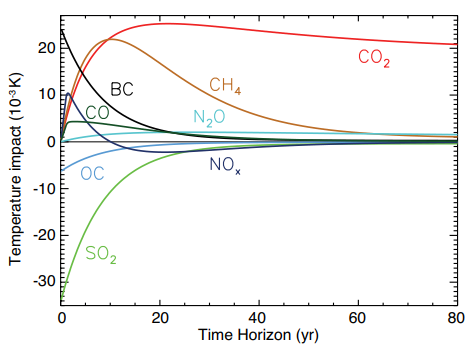

# Temperature model
The temperature model computes the evolution of atmospheric and ocean temperature following change in green house gases (C02, CH4, N2O) concentrations. In contains three equations, one for the radiative forcing and two equation for the climate system, all extracted from DICE[^1]  model with no modification (Nordhaus, 2017). 

## Radiative forcing

Various metrics intermediate between cause and effect are used to provide estimates of the climate impact of individual factors. Radiative forcing (RF) is one of the most widely used metrics. Though usually difficult to observe, calculated radiative forcing  provides a simple quantitative basis for comparing some aspects of the potential climate response to different imposed agents, especially global mean temperature, and hence is widely used in the scientific community. [^2]

The radiative forcing refers to an instantaneous change in net (down minus up) radiative flux (shortwave plus longwave; in Watts per m2) due to an imposed change. This forcing is usually defined in terms of flux changes at the top of the atmosphere.

Different anthropogenic emissions are impacting the climate change and these impacts should be modeled with radiative forcing. 

Temperature response by component for total anthropogenic emissions for a 1-year pulse.

In the above figure, Longer and higher temperature responses to gas emission increases are due to CO2, CH4 and N2O emissions. Consequently, the majority of climate IAM models compute radiative forcing of these three greenhouse gases, respectively CO2, CH4 and N2O molecules. 

### DICE Radiative forcing model

The radiative forcing model of DICE takes into account only CO2 radiative forcing with a logarithm variation and other radiative forcing are computed with a linear model assumption (based on a given SSP scenario) : 

$$RF_t = \eta.\frac{\ln(C_{CO2}^t) - ln(C_{CO2}^{1750})}{ln(2)}+F_{t\,EX}$$
$RF_t$ in watts per m2, $C_{CO2}^t$ the atmospheric concentration of C02 in Gtc (defined in Carbon Cycle model), $C_{CO2}^{1750}$ the level of CO2 atmospheric concentration before industrial revolution, $\eta$ the increase in forcing from the doubling of CO2 in the atmosphere and $RF_{t\,EX}$ forcing from gases other than CO2 at $t$. 
If $t < t_{max}$:  
 $$RF_{t\,EX}= RF_{0\,EX} + \frac{1}{17}(RF_{t_{max}\,EX} - F_{0\,EX}).(t-1)$$
 and for $t = t_{max}:\:RF_{t\,EX}= RF_{t_{max}\,EX}$ corresponding to $hundred\_forcing\_nonco$ in the inputs and $t_{max}$ the last period. 

### Myhre Radiative forcing model [^3]

In the paper of Myhre &al [^3], the greenhouse gases radiative forcing is based on 3 major gas emissions : CO2, CH4 and N20. The CO2 radiative forcing is expressed as in DICE formulation : 

$$RF_{CO2,t} = \eta.\frac{\ln(C_{CO2}^t) - ln(C_{CO2}^{1750})}{ln(2)}$$

The CH4 and N2O radiative forcing equation is the following : 

$$RF_{CH4,N2O,t} = 0.036 (\sqrt{C_{CH4}^t}-\sqrt{C_{CH4}^{1750}}) - MN(C_{CH4}^t,C_{N20}^{1750})  \\ + 0.12 (\sqrt{C_{N2O}^t}-\sqrt{C_{N2O}^{1750}}) -MN(C_{CH4}^{1750}t,C_{N20}^{t}) \\ + 2MN(C_{CH4}^{1750},C_{N20}^{1750})$$

with $MN$ a function defined as : 

$$MN(c1,c2) =0.47 \log(1 + 2.01.10^{-5}  (c_1  c_2)^{0.75} +
5.31.10^{-15} c_1  (c_1 c_2)^{1.52})$$

The Myhre equation is mainly used in climate change models such as in MAGICC [^4], FUND [^5] or FAIR [^6] models.

### Etminan Radiative forcing model [^7]

The model of Etminan [^7] is an improved version of the Myhre model especially for methane emissions impact.

$$RF_{CO2,t} = \eta_{CO2,Etminan}(\ln(C_{CO2}^t) - ln(C_{CO2}^{1750}))$$

with :

$$\eta_{CO2,Etminan} = -2.4.10^{-7} (C_{CO2}^t - C_{CO2}^{1750})^2 + 7.2.10^{-4} abs(C_{CO2}^t - C_{CO2}^{1750}) \\ -2.1.10^{-4} * n2o_{mean} + \frac{\eta}{np.log(2)}$$

$$n2o_{mean}= \frac{1}{2}(C_{N2O}^t + C_{N2O}^{1750})$$

The CH4 and N2O radiative forcing equation is the following :

$$RF_{CH4,t} = \eta_{CH4,Etminan}(\sqrt{C_{CH4}^t}-\sqrt{C_{CH4}^{1750}})$$

$$RF_{N2O,t} = \eta_{N2O,Etminan}(\sqrt{C_{N2O}^t}-\sqrt{C_{N2O}^{1750}})$$

with : 

$$\eta_{CH4,Etminan} = -1.3e-6 * ch4_{mean} - 8.2e-6 * n2o_{mean} + 0.043 $$

$$\eta_{N2O,Etminan} = -8.0e-6 * co2_{mean} + 4.2e-6 * n2o_{mean} - 4.9e-6 * ch4_{mean} + 0.117 $$

$$co2{mean}= \frac{1}{2}(C_{CO2}^t + C_{CO2}^{1750})$$
$$ch4_{mean}= \frac{1}{2}(C_{CH4}^t + C_{CH4}^{1750})$$

The Etminan equation is  used in FAIR [^6] model.

### MeinsHausen Radiative forcing model [^8]

The model of MeinsHausen is another improved version of the Myhre model (See [^8] for more details on equations). The model is  used in FAIR [^6] model.

## Temperature Models

### DICE

#### Atmospheric temperature
Radiative forcing warms up the atmosphere which leads to a warm up in the upper ocean and then the lower ocean. The increase in atmospheric temperature in degree celsius is:  
$$T_{t\,AT} = T_{t-1\,AT} + \xi_1[F_t - \lambda T_{t-1} - \xi_2(T_{t-1} - T_{t-1\,LO})]$$
with $\xi_i$ the transfer coefficients reflecting the rates of flow and thermal capacities of the sinks for a $time step$ = 5 that we adapt to the current time step. $\xi_1$ is $climate\_upper$ in the inputs and $\xi_2$ $transfer\_upper$. Lastly $\lambda  = \frac{forcing\_eq\_C02}{eq\_temp\_impact}$ is climate sensitivity.

#### Ocean temperature
The increase in ocean temperature is: 
$$T_{t\,LO} = T_{t-1\,LO} + \xi_3(T_{t-1} - T_{t-1\,LO})$$
with $\frac{1}{\xi_3}$ the transfer rate from the upper ocean to the deep ocean ($transfer\_lower$ in the inputs).   

### The Climate Framework for Uncertainty, Negotiation and Distribution (FUND) 

From the FUND Online Documentation [^9], we have a model describing global temperature evolution with respect to greenhouse gases concentrations in the atmosphere.
It also models the sea level rise (instead of the ocean temperature in DICE). The description of the FUND Model is extracted from their Online Documentation.
Temperature and sea level are calibrated to the best guess temperature and sea level for the IS92a scenario of Kattenberg et al. (1996).[^10]

#### Global Mean Temperature
The global mean temperature $T$ is governed by a geometric build-up to its equilibrium (determined by radiative forcing $RF$). In the base case, global mean temperature $T$ rises in equilibrium by 3.0°C for a doubling of carbon dioxide equivalents, so:

$$T_t = \left(1-\frac{1}{\varphi}\right)T_{t-1} + \frac{1}{\varphi} \frac{CS}{5.35 \ln{2}} RF_t$$

where $CS$ is climate sensitivity, set to $3.0$. $\varphi$ is the e-folding time and set to

$$\varphi = \max{\left(\alpha + \beta^l CS + \beta^q CS^2, 1\right)}$$

where $\alpha$ is set to $-42.7$, $\beta^{l}$ is set to $29.1$ and $\beta^{q}$ is set to 0.001, such that the best guess e-folding time for a climate sensitivity of $3.0$ is $44$ years.

###### Natural variations around global mean temperature

Once the global mean temperature is computed by the model, some natural fluctuations exist around that result.
The amplitude of these fluctuations is estimated at 0.25°C [^11]. Important contributors of these variations can be the ENSO (El Niño System Oscillation), or volcanic eruptions for instance.
This margin is represented in the graphics to explain the gap that can exist between predictions of the model and 
observed temperature for a given year.

#### Sea Level Rise

Global mean sea level is also geometric, with its equilibrium level determined by the temperature and a life-time of $500$ years:

$$S_t = \left(1-\frac{1}{\varphi}\right)S_{t-1} + \gamma\frac{1}{\varphi} T_t$$

where $\rho = 500$ is the e-folding time. $\gamma = 2$ is sea-level sensitivity to temperature.

### References 

[^1]: Nordhaus, W. D. (2017). Revisiting the social cost of carbon. Proceedings of the National Academy of Sciences, 114(7), 1518-1523.
[^2]: Myhre, G., D. Shindell, F.-M. Br�on, W. Collins, J. Fuglestvedt, J. Huang, D. Koch, J.-F. Lamarque, D. Lee, B. Mendoza,
T. Nakajima, A. Robock, G. Stephens, T. Takemura and H. Zhang, 2013: Anthropogenic and Natural Radiative Forcing. In: Climate Change 2013: The Physical Science Basis. Contribution of Working Group I to the Fifth Assessment Report of the Intergovernmental Panel on Climate Change [Stocker, T.F., D. Qin, G.-K. Plattner, M. Tignor, S.K. Allen, J. Boschung, A. Nauels, Y. Xia, V. Bex and P.M. Midgley (eds.)]. Cambridge University Press, Cambridge, United Kingdom and New York, NY, USA.
[^3]: Myhre, G., Highwood, E.J., Shine, K.P. and Stordal, F., 1998. New estimates of radiative forcing due to well mixed greenhouse gases. Geophysical research letters, 25(14), pp.2715-2718.
[^4]: Gieseke, R., Willner, S.N. and Mengel, M., 2018. Pymagicc: A Python wrapper for the simple climate model MAGICC. Journal of Open Source Software, 3(22), p.516.
[^5]: Anthoff, D. and Tol, R.S., 2009. The impact of climate change on the balanced growth equivalent: An application of FUND. Environmental and Resource Economics, 43(3), pp.351-367.
[^6]: Smith, C.J., Forster, P.M., Allen, M., Leach, N., Millar, R.J., Passerello, G.A. and Regayre, L.A., 2018. FAIR v1. 3: a simple emissions-based impulse response and carbon cycle model. Geoscientific Model Development, 11(6), pp.2273-2297.
[^7]: Etminan, M., Myhre, G., Highwood, E., and Shine, K.: Radiative forcing of carbon dioxide, methane, and nitrous oxide: A significant revision of the methane radiative forcing, Geophysical Research Letters, 43, 2016
[^8]: Meinshausen, M., Nicholls, Z.R., Lewis, J., Gidden, M.J, Vogel, E., Freund, M., Beyerle, U., Gessner, C., Nauels, A., Bauer, N. and Canadell, J.G., 2020. The shared socio-economic pathway (SSP) greenhouse gas concentrations and their extensions to 2500. Geoscientific Model Development, 13(8), pp.3571-3605
[^9]: FUND Model Online Documentation (http://www.fund-model.org/MimiFUND.jl/latest/science/#.3.-Temperature-and-sea-level-rise-1)
[^10]: Kattenberg, A., F.Giorgi, H.Grassl, G.A.Meehl, J.F.B.Mitchell, R.J.Stouffer, T.Tokioka, A.J.Weaver, and T.M.L.Wigley (1996), 'Climate Models - Projections of Future Climate', in Climate Change 1995: The Science of Climate Change – Contribution of Working Group I to the Second Assessment Report of the Intergovernmental Panel on Climate Change, 1 edn, J.T. Houghton et al. (eds.), Cambridge University Press, Cambridge, pp. 285-357.
[^11] [Berkley's Earth Analysis](https://berkeleyearth.org/global-temperature-report-for-2023/#:~:text=Annual%20Temperature%20Anomaly&text=As%20a%20result%2C%202023%20is,C%20(2.7%20%C2%B0F).)