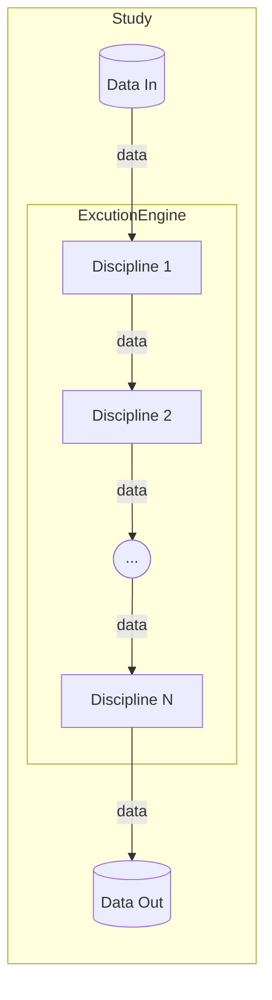
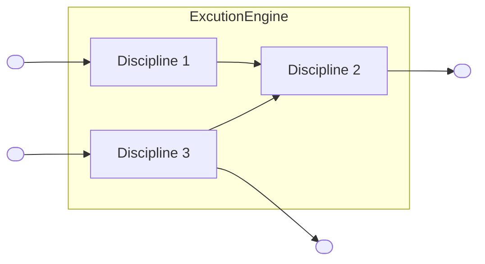

# How to Model a Study

## 1. Overview

In `witness-core`, a study is a way to evaluate the effect of specific energy
ways of production, on specific aspects of climate change and macro-economy.

A _study_ includes data and a series of processing steps.
Individual processing steps are called _disciplines_.
The diagram below shows components of a study.



The steps to model a study are:

- provide input data in format, recognized by used disciplines
- import existing disciplines, or create new disciplines, if necessary
- couple used disciplines together
- execute the study
- post-process output data (visualize, export, etc.)

Examples of studies may be found as `usecase.py` scripts within
`witness-core`.

## 2. Data Formats

A general format of input and output data, used by disciplines, is a
standard python _dictionary_.
Internal keys and formats of input and output dictionaries are specified by
disciplines, based on their processing algorithms.

Theoretically, input and output data may be as simple as a dictionary with one
array:

```
DESC_IN = {
    'values': {'type': 'array'}
}
```

Practically, input and output dictionaries are usually more complex:

```
DESC_IN = {
    'transport_cost': {'type': 'dataframe', 'unit': '$/MWh'},
    'transport_margin': {'type': 'dataframe', 'unit': '%', },
    'initial_production': {'type': 'float', 'unit': 'TWh',
                           'default': 136917.16},
    'initial_age_distrib': {'type': 'dataframe', 'unit': '%'},
    'invest_before_ystart': {'type': 'dataframe', 'unit': 'G$'}
}
```

A common data type, used in input and output dictionaries of disciplines, is
_dataframe_.
Dataframe is a 2-dimensional labeled data structure, defined by a python
library `pandas`. For more details on dataframes, see
[pandas user guide](https://pandas.pydata.org/pandas-docs/stable/user_guide/dsintro.html#dataframe).

Below is an example of creating a dataframe.

```
years = np.arange(self.year_start, self.year_end + 1, 1)

crop_investment = pandas.DataFrame({'years': years,
                                    'investment': np.ones(len(years)) * 0.381
                                   })
```

## 3. Disciplines

Discipline is a processing step in a study, introduced by a python library
`gemseo`. For more details on the concept of disciplines, see
[gemseo user guide](https://gemseo.readthedocs.io/en/stable/discipline.html).

In `witness-core`, disciplines are derived from the base class
`SoSDiscipline`, and should define:

- `_ontology_data` and `_maturity` - for Witness GUI
- `DESC_IN` and `DESC_OUT` - specify format of input and output dictionaries
- `run()` - execute a data processing algorithm

Below is a simple example of a discipline, derived from `SoSDiscipline`.

```
class Disc0(SoSDiscipline):

    # ontology information
    _ontology_data = {
        'label': 'sos_trades_core.sos_wrapping.test_discs.disc0',
        'type': 'Research',
        'source': 'SoSTrades Project',
        'validated': '',
        'validated_by': 'SoSTrades Project',
        'last_modification_date': '',
        'category': '',
        'definition': '',
        'icon': '',
        'version': '',
    }

    _maturity = 'Fake'

    DESC_IN = {
        'r': {'type': 'float'},
        'mod': {'type': 'int', 'default': 1}
    }
    DESC_OUT = {
        'x': {'type': 'float', 'visibility': 'Shared', 'namespace': 'ns_disc1'},
        'a': {'type': 'int', 'visibility': 'Shared', 'namespace': 'ns_disc1'}
    }

    def run(self):

        r = self.get_sosdisc_inputs('r')
        mod = self.get_sosdisc_inputs('mod')
        a, x = divmod(r, mod)

        dict_values = {'a': int(a), 'x': x}

        self.store_sos_outputs_values(dict_values)
```

For more examples of simple disciplines, see the folder `sos_wrapping` in
the repo `sostrades-core`.
For more examples of disciplines, practical from `witness-core` perspective,
see the folder `sos_wrapping` in this repo.

In `DESC_IN` and `DESC_OUT`, fields `visibility` and `namespace` specify
visibility of data to external callers and coupled disciplines.

## 4. Coupling of Disciplines

All disciplines, which execute a study, are loaded into an `ExecutionEngine`.
It couples disciplines together, when a study requires multiple steps of data
processing. An example of coupling is shown on the diagram below.



To couple output data of one discipline with input data of the other, the
corresponding dictionary keys should:

- have the same name
- have `visibility` set to `Shared`
- have the same `namespace`

An example below shows two disciplines, which will be coupled through a key
`wave2`, if loaded into the same `ExecutionEngine`.

```
class DiscA(SoSDiscipline):
    DESC_IN = {
        'wave1': {'type': 'array' },
    }
    DESC_OUT = {
        'wave2': {'type': 'array',
                  'visibility': 'Shared',
                  'namespace': 'ns_wave_processing'
                  },
    }

class DiscB(SoSDiscipline):
    DESC_IN = {
        'wave2': {'type': 'array',
                  'visibility': 'Shared',
                  'namespace': 'ns_wave_processing'
                  },
    }
    DESC_OUT = {
        'wave3': {'type': 'array',
                  'visibility': 'Shared',
                  'namespace': 'ns_wave_processing'
                  },
    }
```

Notice, that `DESC_OUT` keys need to have `visibility` set to `Shared`, to
be accessible by external callers.

## 5. Study Manager

`StudyManager` is a base class, which handles:

- initialization of disciplines
- load of input data and disciplines into an `ExecutionEngine`
- run the execution of disciplines
- storing output data

In `witness-core`, a study is implemented by a class, which should:

- derive from `StudyManager`
- define a method `setup_usecase`, to setup input data and disciplines

The `run` method of `StudyManager` internally triggers `ExecutionEngine`.

Below is a simple example of executing a study in a python script.

```
if '__main__' == __name__:
    uc_cls = Study()

    # Load input data for a study
    uc_cls.load_data()

    # Run ExecutionEngine on disciplines in a study
    uc_cls.run()

    # Get output data
    ppf = PostProcessingFactory()
    for disc in uc_cls.execution_engine.root_process.sos_disciplines:
        out_data = disc.get_sosdisc_outputs()
```

Examples of studies may be found as `usecase.py` scripts within
`witness-core`.

## 6. Post-processing Output Data

Output data of a study may be used for post-processing (visualize, export,
etc.) outside of `witness-core`.
Common methods include:

- Witness GUI
- plotting from a script

There is no universal recommendation on post-processing of the outcome of a
study. The choice of a post-processing method depends on what may better
support decision making for an energy transition, for a target climate change
impact.
